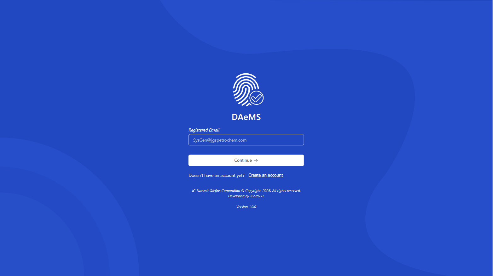
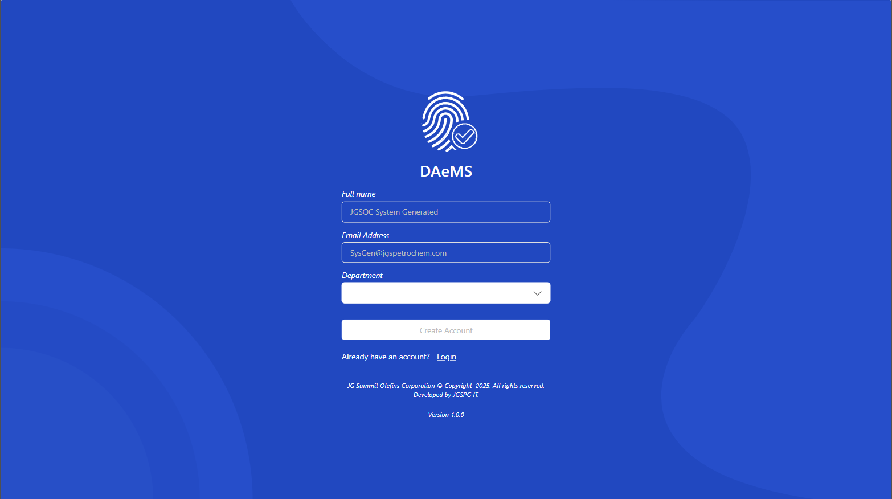
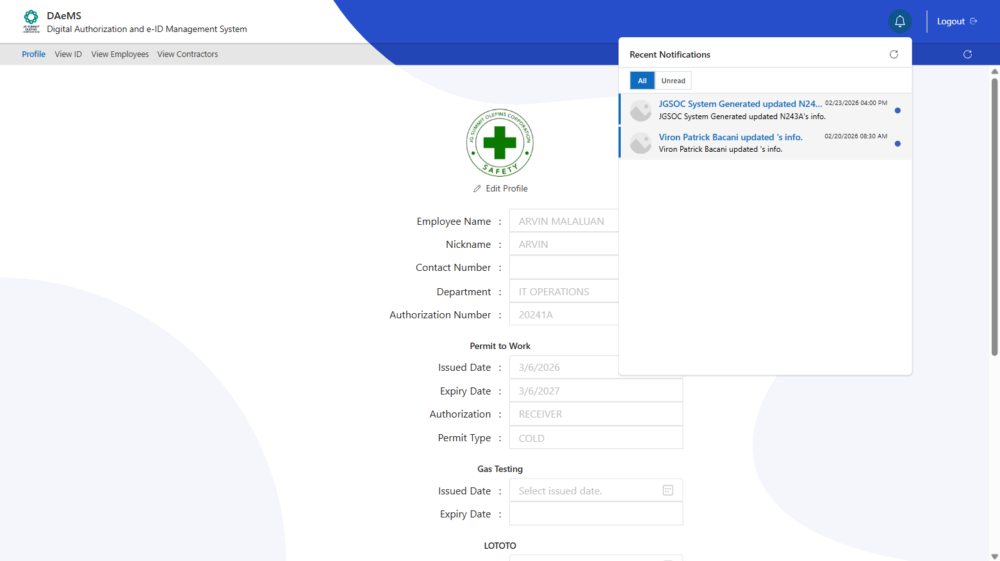
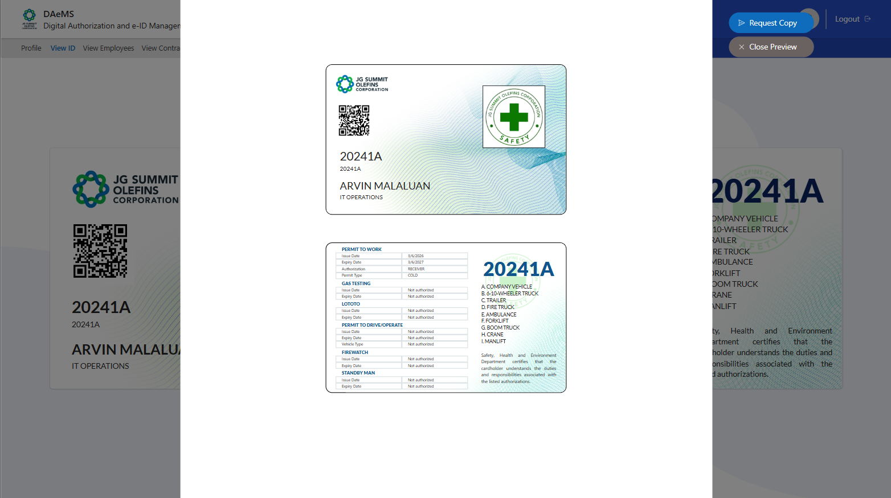
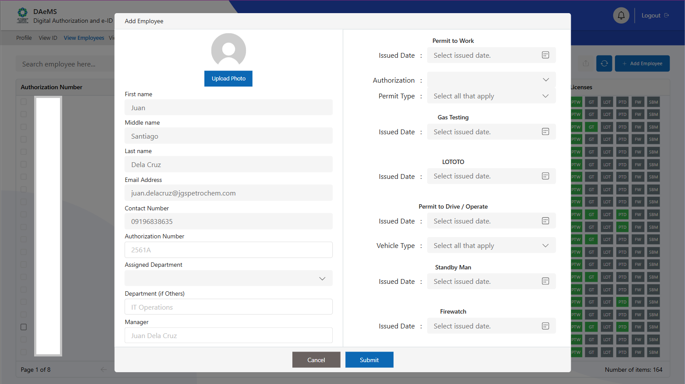
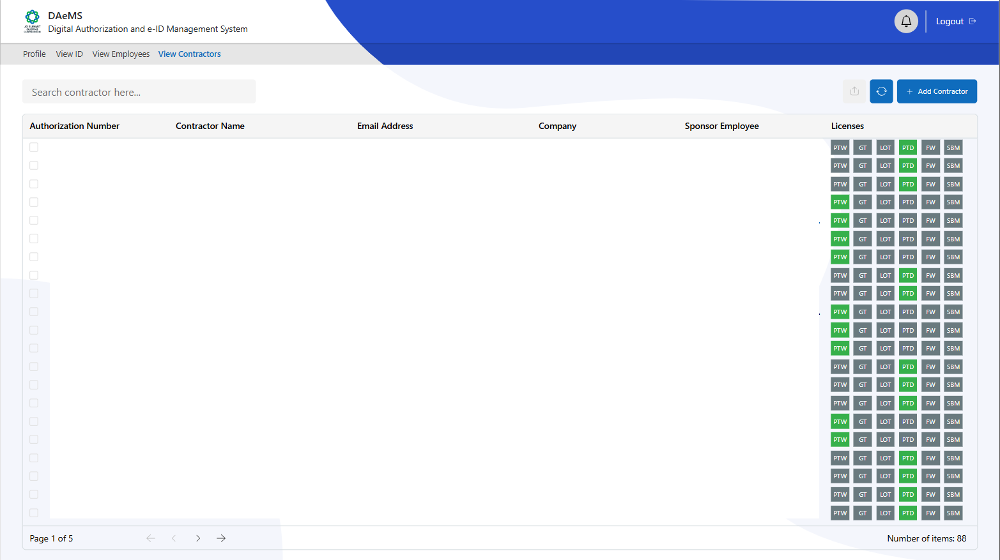

# 📱 DAeMS (PowerApps)

---

## 📌 Project Overview
A PowerApps-based digital authorization and e-ID management system that helps admins and employees manage authorization IDs efficiently. It tracks license expirations, allows profile updates, supports email requests for ID copies, and enables admins to manage users (employees/contractors) while maintaining full control over critical updates. Designed with performance, scalability, and clean UI/UX in mind, even with large datasets and delegation limits.

---

## 🖼️ UI Preview

---
Here’s an updated version tailored to your digital authorization and e-ID system:

---

## ⚙️ What’s Under the Hood

* **Data Handling Strategy:**

  * Delegation-aware queries for large datasets
  * Pagination to bypass record limits
* **Role-Based Logic:**

  * Conditional access for admins vs. employees
  * Secured actions (e.g., updating licenses, adding users)
* **Custom UX Enhancements:**

  * Non-native modals for requests and approvals
  * Dynamic notifications for license expiries and requests

---

## ✨ Features

* 🔐 Role-based access control (Admin/Employee)
* 📅 License expiry tracking & notifications
* 📝 Profile updates by employees
* 📧 ID copy requests via email
* ➕ Add employees/contractors (Admin only)
* ✅ User input validation
* 🪟 Custom modals for actions
* 🎨 Minimalist, clean design
* ⚡ Optimized for performance and scalability

---

## 🛠️ Tech Stack
- **PowerApps (Canvas App)**
- **Power Fx**
- **Data Source:** SharePoint (Lists)  
- **Power Automate**

---

## ⚠️ Challenges
- Delegation limits (500–2000 records)  
- Managing complex conditional UI logic
- Creating a UI component in scale of printable pdf document.  
- Performance issues with large datasets  
- Maintaining clean UX without relying on native components  

---

## 💡 Solutions Implemented
- Built **custom pagination system**
- Used **delegation-friendly functions** (`Filter`)
- Use of HTML in power automate then convert it to pdf.
- Created **modular components** for reusability
- Structured logic to reduce re-renders and heavy computations

---

## 🙌 Special Thanks
- **[powericons.dev](https://www.powericons.dev)** — a great tool for enhancing UI with clean and consistent icons

---

## 📷 Additional Screens

